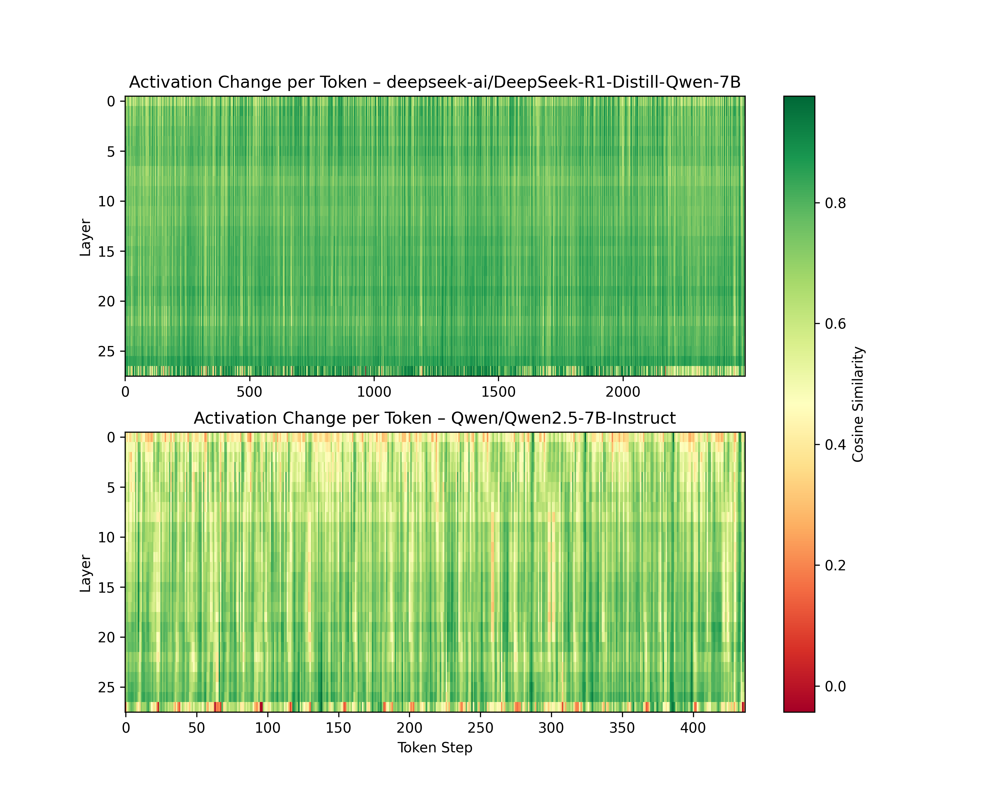
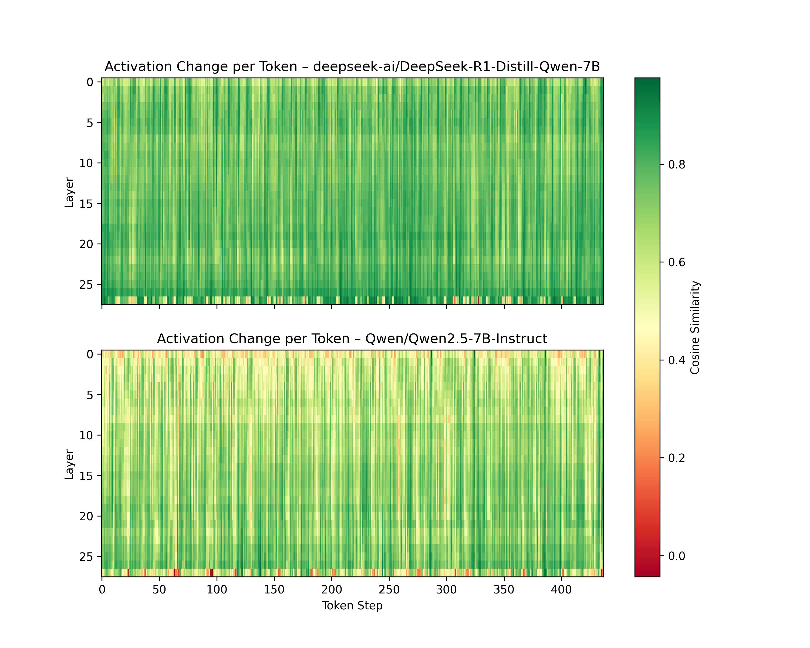
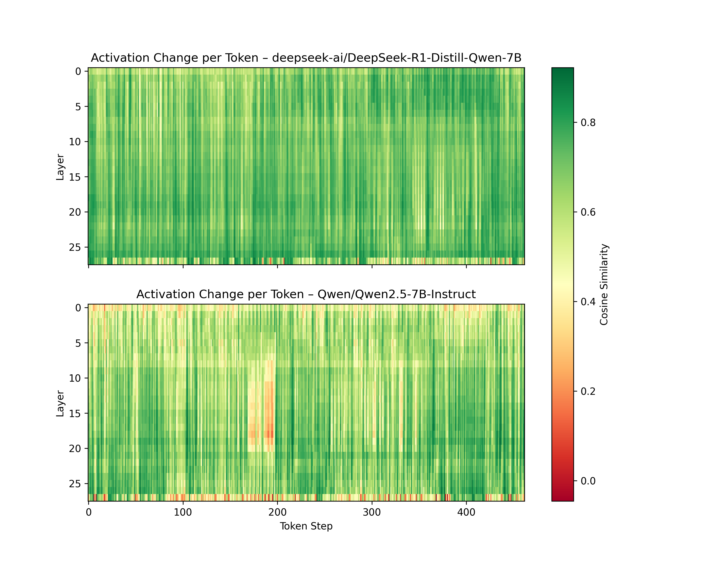

# Activation Dynamics in LLMs vs LRMs 

This project investigates how **finetuning for reasoning** affects the internal activation dynamics of a LLM. The goal is to show that reasoning sft induces **smaller, more structured changes** in the model's hidden states across token generation steps — supporting the intuition that reasoning allows the model to traverse a smoother energy function.

---

## Usage

`generate_activations.py`: to run inference on a specified benchmark and save the intermediate activations to a folder
`plot_activations.py`: to calculate and plot activation dynamics across tokens for the saved activations

---

## Example

